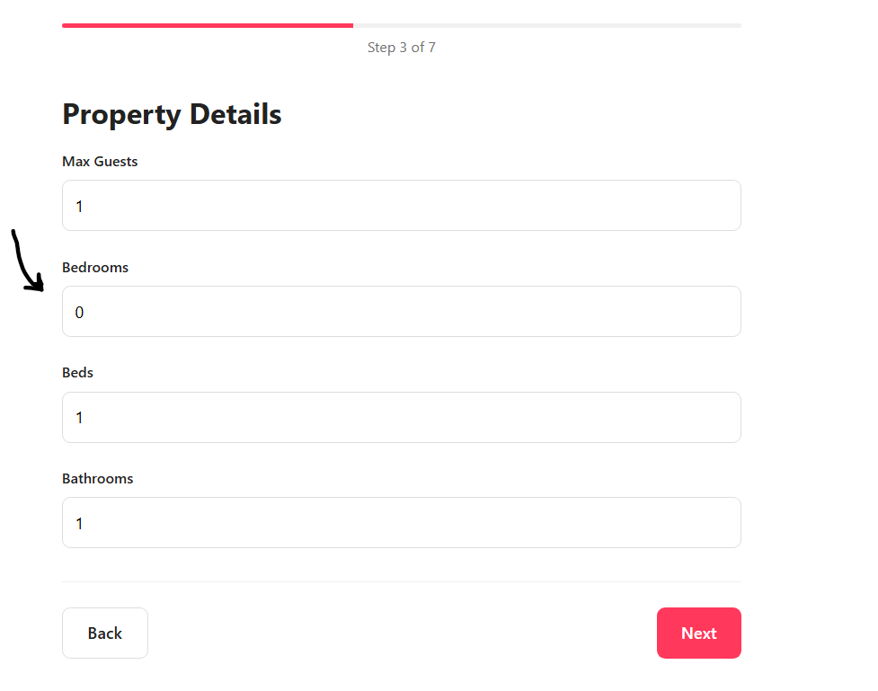
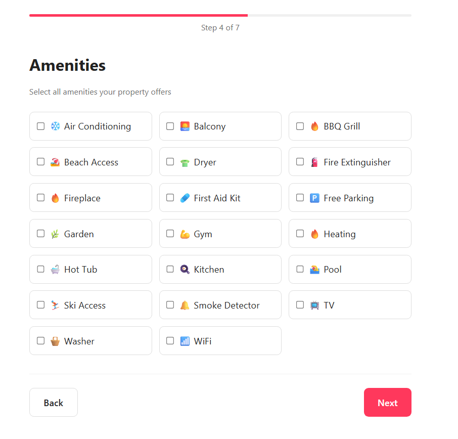
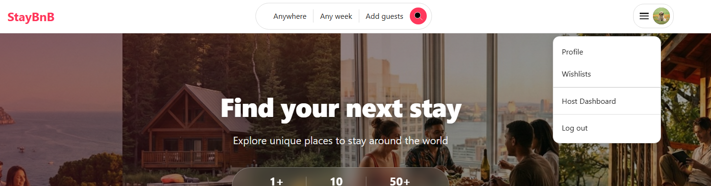
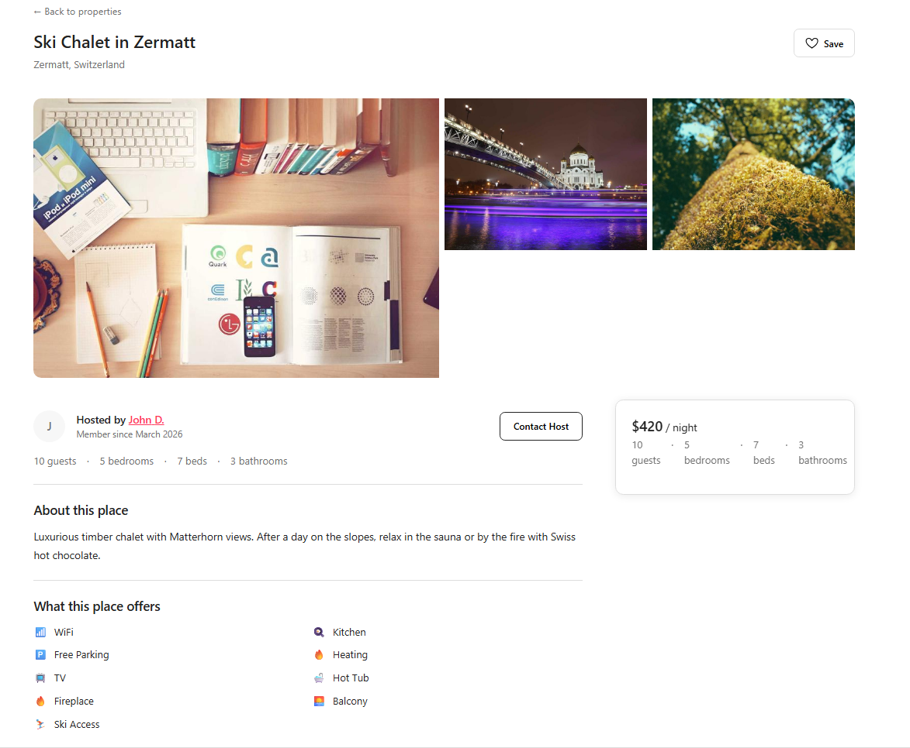
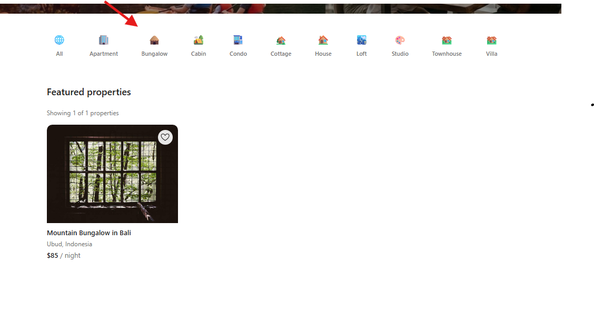
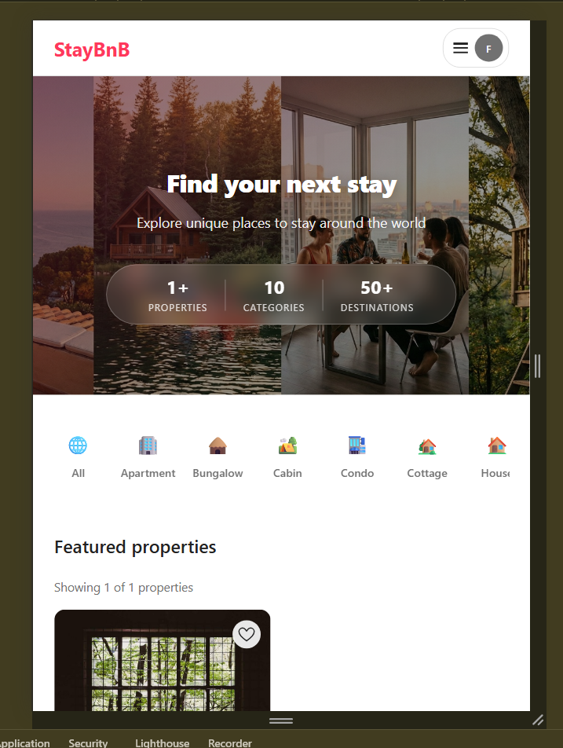
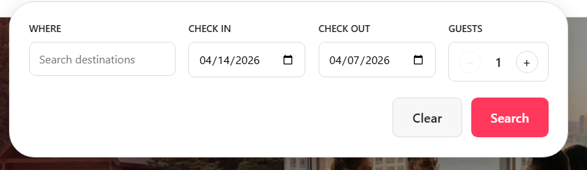

# Defect Catalogue

All known defects in the StayBnB QA environment. Each entry includes a description, reproduction steps, and the expected vs. actual behaviour.

---

## BUG-1 — Beds Minimum Constraint Not Enforced (Create Property Step 3)

**Sprint:** 2
**Area:** Create Property — Step 3
**Test:** `CreatePropertyStep3Test#testStep3BedsMinimumIsOne`
**Status:** Open
**Severity:** Medium

**Description:** The "Beds" counter on the Details step allows a value of 0. The expected minimum is 1.

**Steps to reproduce:**
1. Log in as a host user.
2. Navigate to `/hosting/create`.
3. Progress through Steps 1–2.
4. On Step 3 (Details), observe the initial/minimum value of the **Beds** counter.

**Expected:** Minimum is 1 — the decrement button is disabled at 1.
**Actual:** Minimum is 0 — the counter can be decremented to 0.

**Screenshots:**

---

## BUG-2 — Non-Host Direct Navigation to `/hosting/create` Does Not Return 403

**Sprint:** 2
**Area:** Access Control
**Test:** `CreatePropertyStep1Test#testNonHostAccessToCreatePropertyIsBlockedWith403`
**Status:** Open
**Severity:** Low

**Description:** When a non-host user navigates directly to the create-property URL, they should see a 403 error (or be redirected to the "Become a Host" flow). Neither happens — the page loads without any access block.

**Steps to reproduce:**
1. Register a brand-new user (not yet a host).
2. Directly navigate to `{BASE_URL}/hosting/create`.

**Expected:** A 403 error page is displayed.
**Actual:** A different error page is displayed — not a 403.

---

## BUG-3 — Amenity Groups Missing on Create Property Step 4

**Sprint:** 2
**Area:** Amenities
**Tests:** `CreatePropertyStep4Test#testStep4AmenitiesGroupedByEssentials`, `testStep4AmenitiesGroupedByFeatures`, `testStep4AmenitiesGroupedBySafety`
**Status:** Open
**Severity:** Medium

**Description:** The amenities grid on Step 4 is supposed to render amenities organised under three group headings: **Essentials**, **Features**, and **Safety**. None of these headings are present.

**Steps to reproduce:**
1. Log in as a host user.
2. Navigate to `/hosting/create`.
3. Progress through Steps 1–3 to reach Step 4 (Amenities).
4. Inspect the amenities grid for group labels.

**Expected:** Amenities are visually grouped under "Essentials", "Features", and "Safety" headings.
**Actual:** No group headings are rendered; amenities appear ungrouped.

**Screenshots:**

---

## BUG-5 — Navbar Does Not Show "My Properties" After Becoming a Host

**Sprint:** 2
**Area:** Hosting — Become a Host
**Test:** `BecomeHostTest#testNavbarShowsMyPropertiesAfterBecomingHost`
**Status:** Open
**Severity:** High

**Description:** After a user successfully completes the "Become a Host" flow, the navbar should surface a **"My Properties"** link. The link does not appear.

**Steps to reproduce:**
1. Register a new user.
2. Click "Become a Host" in the navbar and complete the flow.
3. Navigate back to the home page.
4. Inspect the navbar.

**Expected:** A "My Properties" (host dashboard) link is visible in the navbar.
**Actual:** The link is absent — the navbar does not update to reflect the new host status.

**Screenshots:**

---

## BUG-7 — Property Details Page Does Not Show Category Alongside Type

**Sprint:** 2
**Area:** Property Details
**Test:** `PropertyCategoriesTest#testPropertyDetailsShowsCategoryAlongsidePropertyType`
**Status:** Open
**Severity:** Low

**Description:** The property type field on the property details page is expected to include the category separated by a `·` character (e.g., `"Apartment · Beach"`). The category portion is missing.

**Steps to reproduce:**
1. Open any property listing's detail page.
2. Inspect the property type/category display element.

**Expected:** Text is formatted as `"<Type> · <Category>"`.
**Actual:** Only the type is shown; the `·` separator and category are absent.

**Screenshots:**

---

## BUG-8 — Selecting a Category Chip Does Not Mark It as Active

**Sprint:** 2
**Area:** Home Page — Categories
**Test:** `PropertyCategoriesTest#testSelectingCategoryMarksChipAsActive`
**Status:** Open
**Severity:** Low

**Description:** Clicking a category chip on the home page should apply an active/selected style to that chip. The active state is not applied.

**Steps to reproduce:**
1. Open the home page.
2. Click the **"Bungalow"** category chip in the category bar.
3. Observe the chip's visual state.

**Expected:** The "Bungalow" chip is rendered in an active/selected state.
**Actual:** The chip has no active styling after being clicked.

**Screenshots:**

---

## BUG-9 — Mobile Compact Search Bar Not Visible in Navbar

**Sprint:** 3
**Area:** Search
**Test:** `SearchTest#testMobileCompactSearchBarIsVisible`
**Status:** Open
**Severity:** High

**Description:** In a mobile viewport, the navbar should display a compact search bar. It is not rendered.

**Steps to reproduce:**
1. Open the home page.
2. Switch to a mobile layout (narrow viewport, e.g., 375 px wide).
3. Inspect the navbar.

**Expected:** A compact/collapsed search bar is visible inside the navbar.
**Actual:** No compact search bar is displayed.

**Screenshots:**

---

## BUG-10 — Check-In Date Picker Allows Past Dates

**Sprint:** 3
**Area:** Search
**Status:** Open
**Severity:** High

**Description:** When the search form is expanded and the user opens the check-in date picker, dates in the past should not be selectable.

**Steps to reproduce:**
1. Open the home page and expand the search form.
2. Click the check-in date field to open the date picker.
3. Attempt to select a date from a previous month.

**Expected:** Only today and future dates are selectable; past dates are disabled.
**Actual:** Past dates are selectable.

**Screenshots:**

---

## BUG-11 — Check-Out Date Picker Allows Dates Before Check-In

**Sprint:** 3
**Area:** Search
**Status:** Open
**Severity:** High

**Description:** After a check-in date has been selected, the check-out date picker should only allow dates after the check-in date.

**Steps to reproduce:**
1. Open the home page and expand the search form.
2. Select a check-in date (e.g., next Friday).
3. Click the check-out date field.
4. Attempt to select a date earlier than the chosen check-in date.

**Expected:** Only dates after the selected check-in date are selectable.
**Actual:** Dates on or before the check-in date are selectable.

**Screenshots:**

